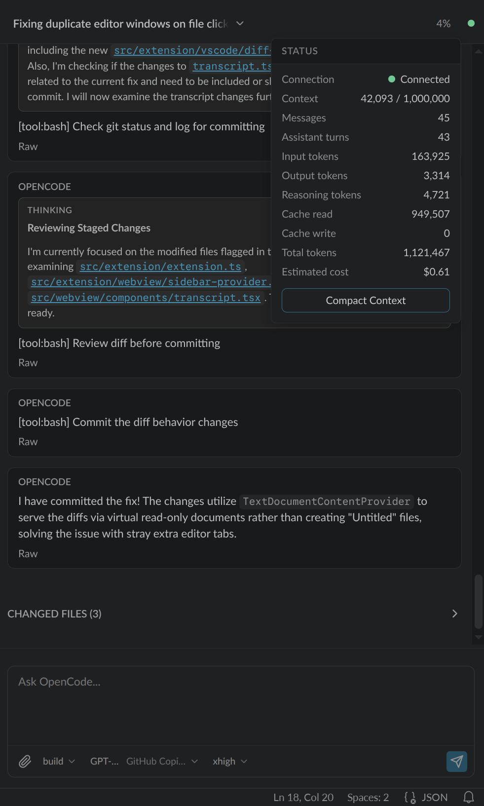
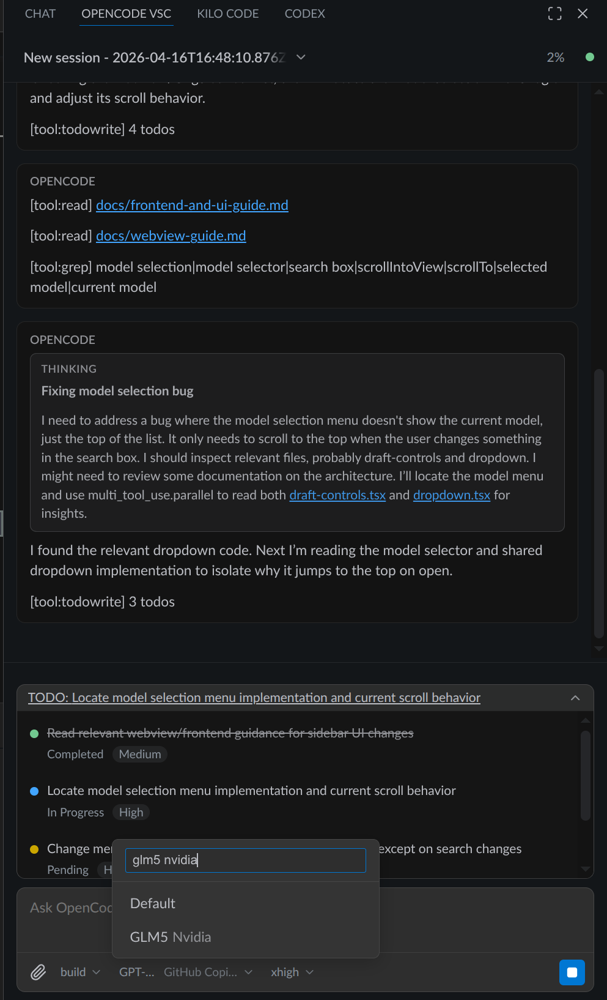

# Opencode VSC

An opencode VS Code extension that works.

## Screenshots

## Features

- Interactive chat interface inside VS Code.
- Session switcher for moving between OpenCode chats in the sidebar.
- Easy file attachment.
- View status and context usage.
- Review the Raw message at any time.
- Clickable file links in chat output to open files directly in VS Code.

## Requirements

You must have the OpenCode CLI installed and configured available on your `PATH`, or set `OpenCode › Cli: Path` to point to the OpenCode binary. 

On activation, the extension starts a managed local `opencode serve` process automatically. You do not need to start an OpenCode server yourself.

## Development

Check out [AGENTS.md](AGENTS.md) and the [docs/](docs/) folder for architecture details and postmortems.

Large portion of this project is vibe-coded, with both manual and AI code review. 